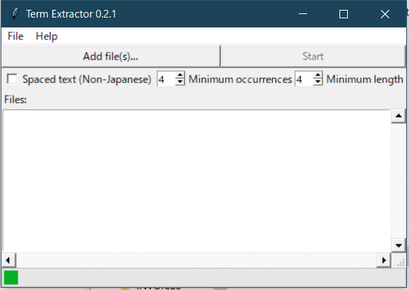
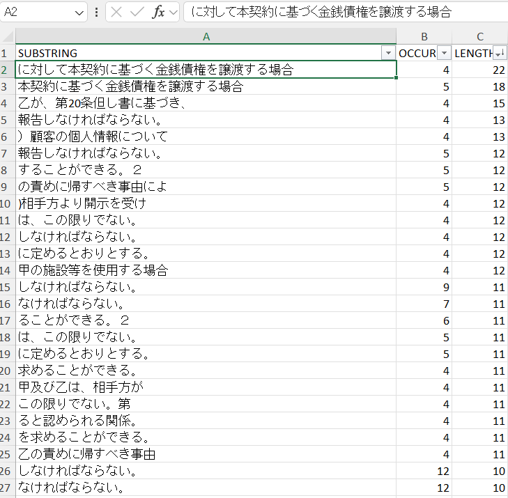

## TERM EXTRACTOR

This is an experiment in trying to find long, repeating substrings in a document to facilitate coordinating translations. The idea is that words and sentences that appear repeatedly throughout a document likely to represent an important idea, so if multiple translators are working on the project, these substrings should be loaded into a shared glossary beforehand so that the translators can ensure consistency.

### How it works

The program itself uses a simple TKinter GUI and a very complicated tree-based search algorithm (modified from [this project](https://github.com/ptrus/suffix-trees)) to search for the longest repeating substrings in a document.  

When a document is processed, the program outputs any repeating substrings to a filtered list in excel for easy sharing in the office.

## Retrospective

This project was entertaining and educational, and long-term has been my most useful piece of programming. I have used it effectively in a few large translation projects. If I was going to work on it again, I would incorporate a tokenizer and search for repeating patterns of tokens, rather than strings of characters, which would probably provide more useful results. The tree search principle itself is one that I haven't seen applied to any other translation software, so I'm quite proud of having made this work.  

The compiled .exe release still works on Windows 11, but the python code itself relies on some outdated libraries to work with various input files. Free to a good home.
