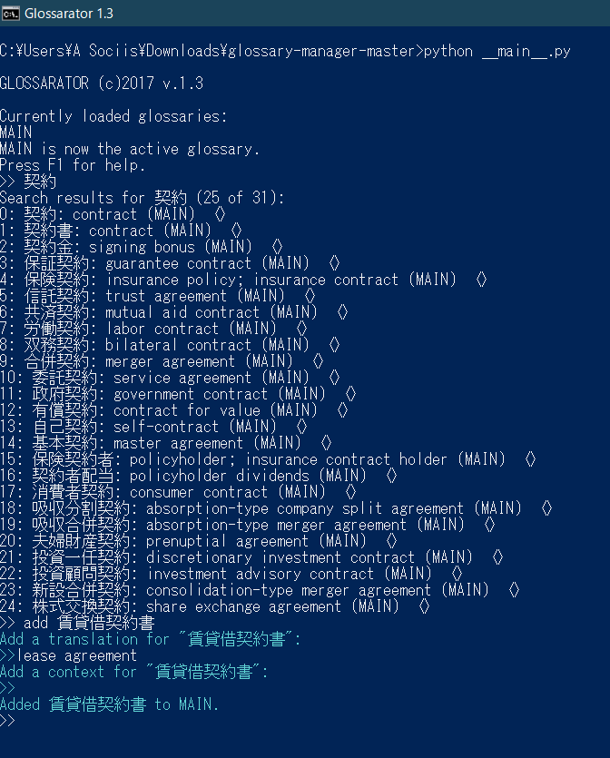

An early attempt at a CSV-based, all text glossary manager in Python 3. Uses an old (1.x) version of the Prompt Python text-based UI library.

 
 ### GENERAL HELP

Type a keyword to search for it. You can cancel any operation with Ctrl + Z.  
Default values can be changed by editing the file "config.ini".  

 ### OTHER COMMANDS  

QUIT:    Print a whimsical message then quit. Deregister the global hotkey.  
SHOW:    Show the results of the last search.  
         ARGS: the maximum number of search results to display.  
LIST:    List all the currently loaded glossaries.  
DEL:     Delete an entry. (ARGS: the number of the search result to delete.)  
ADD:     Add an entry to the active glossary. (ARGS: the source value of the new entry to be added.)  
SET:     Set the active glossary. (ARGS: arg = the short name of the glossary to set as active.)  
EDIT:    Edit an entry by creating a sub-prompt. (ARGS: the number of the search result to edit.)  
SAVE:    Save a modified glossary. Print a list of the glossaries saved. (ARGS: the short name of the glossary to save.)  
RELOAD:  Reload a glossary from file. (ARGS: the short name of the glossary to reload.)  
NEW:     Add a new empty glossary.  
HELP:    Print this help message.  
FUZZY:   Fuzzy search for a keyword. (ARGS: the search keyword. RETURNS: search results, ordered by relevance.)  
CONVERT: Convert an excel-formatted glossary file to the much faster CSV. (ARGS: the short name of the glossary to convert.) 
MOVE:    Move a term from one glossary to another. (SYNTAX: "MOVE 0 to MAIN". ARGS: Search result number; short name of target.)  
SEARCH:  Search for a keyword. (ARGS: the search keyword.)
